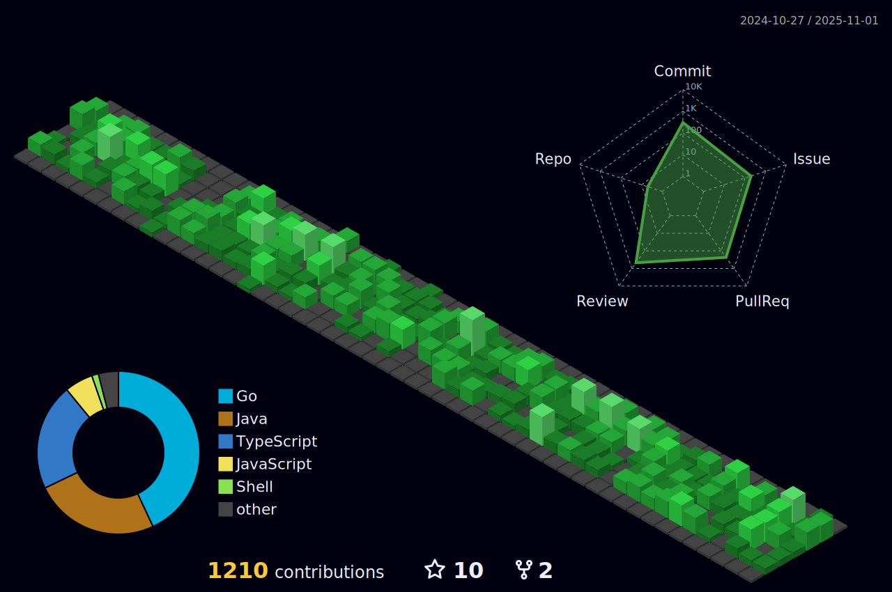

# Welcome!  
### Currently working as a Blockchian Developer.

### 🌱 I’m learning
Golang and Cosmos SDK

### 🚧 I build with...

        
        
        
        
        </a>
        
        
         
         
        
        

  
  

